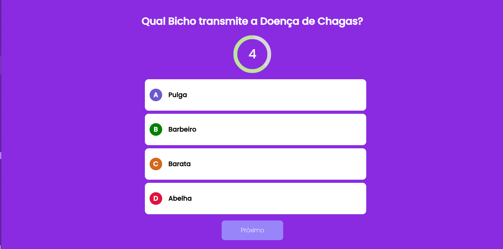

## Projeto Quiz REACT-NEXT-JS


Este projeto foi desenvolvido a fim de adquirir habilidades nas tecnologias TYPSCRIPT, REACT, NEXT JS. Dessa forma a proposta é apresentar um QUIZ virtual, com perguntas e respostas consumidas de uam API.

Para executar este projeto na versão de desenvolvimento use: 

```bash

npm run dev
```


Para executar na versão de produção use:

``` bash

npm start

```


## Tela Inicial


## Tela de reusltados
